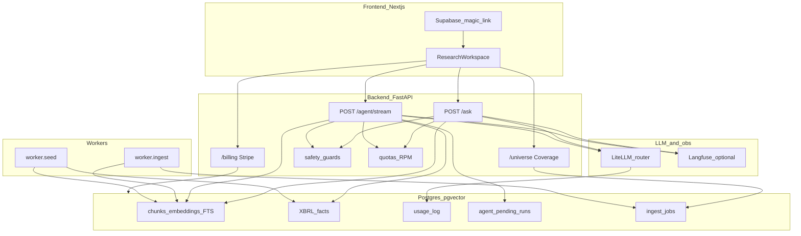

# Moat — AI equity research over SEC filings · [Live demo](https://example.com/moat-demo)

Ask natural-language questions about public-company filings and get
**citation-grounded, streamed** answers backed by real SEC data (10-K / 10-Q
chunks + XBRL facts).

> Demo link is a placeholder until deploy. Local setup below.

## Why it's interesting (engineering)

Honest claims only — see [docs/eval-report.md](docs/eval-report.md) for the
eval layer and [docs/postmortem.md](docs/postmortem.md) for a real failure we
fixed.

- **Ground-truth eval path:** factual cases auto-built from XBRL revenue facts;
  live scoring uses numeric tolerance (1%) **and** `[cite:…]` grounding.
  Manual live gate floors: factual ≥ **0.70**, qualitative = **1.0**
  (sample of 40 factual + 2 qualitative). We do **not** publish a vanity
  accuracy number until a dated live run is checked in.
- **Offline quality gates in CI:** deterministic checks (advice HITL,
  injection sanitize, citation helpers, usage/cost merge, gold retrieval
  schema). Every PR requires `offline_pass_rate == 1.0` — no LLM spend on push.
- **Hybrid retrieval + local rerank:** pgvector dense + Postgres FTS sparse →
  RRF → `BAAI/bge-reranker-v2-m3` cross-encoder. Labeled recall@k gold set gated
  offline (schema) and on live `workflow_dispatch` (`recall_at_5` floor 0.70).
- **Cost-aware gateway:** LiteLLM model routing, `usage_log` token/cost fields
  (Ask stream usage + Agent accumulation), optional semantic answer cache,
  token-gated `GET /metrics/cost`. No fabricated $/req marketing figure in-repo.
- **Observability:** Langfuse v4 traces when both keys are set (Ask chain +
  retrieve/generation; Agent span). Soft no-op if unset.
- **Safety + HITL:** sanitize retrieved filing text and session memory;
  reject injection-like queries; soft ungrounded warning; agent
  Approve/Rewrite when drafts look like buy/sell advice. Agent graph state
  can persist via PostgresSaver (`AGENT_CHECKPOINT`). Deploy checklist:
  [docs/security.md](docs/security.md).
- **Product surface:** Supabase magic-link auth, Stripe free/pro/team,
  plan-gated Coverage (custom ticker ingest into a **shared** corpus),
  Team seats (5), env-gated `/admin`, optional Redis RPM.

## Architecture



**Ask path:** retrieve (hybrid → rerank) → sanitize context → stream completion →
citation / advice checks → `usage_log`.

**Agent path:** LangGraph tool loop (filings + XBRL tools) → SSE tool trail →
usage accumulate → soft grounding warning → HITL pending run if advice-like.

**Coverage:** Free sees default mega-caps; Pro/Team enqueue `ingest_jobs`
(shared-DB skip if already chunked). Run `python -m worker.ingest` for durable
processing.

## Run it locally

```bash
# from repo root — Postgres with pgvector required
cp .env.example .env          # fill DATABASE_URL, provider keys as needed
cp frontend/.env.local.example frontend/.env.local

psql "$DATABASE_URL" -f backend/app/ingest/schema.sql

python -m venv .venv && source .venv/bin/activate
pip install -e "backend[dev]"

# optional: seed default tickers (needs SEC_USER_AGENT + embed provider)
cd backend && python -m worker.seed

uvicorn app.api.main:app --reload --app-dir backend --port 8000

# optional durable ingest worker (Coverage adds)
python -m worker.ingest

# or: docker compose up --build   (api + worker + postgres + redis)

cd frontend && npm ci && npm run dev
# http://localhost:3000
```

Env names only (never commit secrets): see [`.env.example`](.env.example) and
[`frontend/.env.local.example`](frontend/.env.local.example).

More detail: [`backend/README.md`](backend/README.md), [`frontend/README.md`](frontend/README.md),
[`docs/adr/0001-stack.md`](docs/adr/0001-stack.md).

### Quality checks (no paid LLM on PR)

```bash
cd backend
pytest -q
python -m app.evals.run --offline-only   # must print EVAL GATE PASSED

# live Ask + retrieval (costs tokens; manual only)
python -m app.evals.run --sample=40
```

## Plans (product)

| Plan | Asks / month | RPM | Custom tickers | Seats |
|------|-------------:|----:|---------------:|------:|
| Free | 5 | 10 | 0 | 1 |
| Pro | 500 | 60 | 10 | 1 |
| Team | 5000 | 120 | 50 | 5 |

## What I'd do next

Honest roadmap against the current code (not vapor):

1. **LangGraph checkpointer** (e.g. PostgresSaver) if we want durable agent state /
   true interrupt HITL instead of post-hoc pending rows only.
2. **Semantic / structure-aware chunking** beyond token windows + atomic tables.
3. **Expand coverage** toward a larger equity universe (today: ~10 default mega-caps
   + plan-gated adds).
4. **LLM-as-judge** only if needed — qualitative today uses free structural gates
   (section substring + recall@k gold). Judge would burn tokens.
5. **Team invite + Admin UI** — shipped in Account panel; deepen as needed.

## Docs

| Doc | Purpose |
|-----|---------|
| [docs/eval-report.md](docs/eval-report.md) | Eval sets, metrics, CI floors, offline scores |
| [docs/postmortem.md](docs/postmortem.md) | One real bug → fix → lesson |
| [docs/security.md](docs/security.md) | Authz model + deploy security checklist |
| [docs/adr/0001-stack.md](docs/adr/0001-stack.md) | Stack decisions |

## License / contact

Private / coursework build unless otherwise noted. Configure `SEC_USER_AGENT`
with a real contact email before hitting EDGAR.
